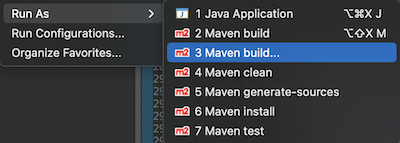
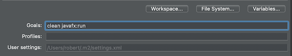
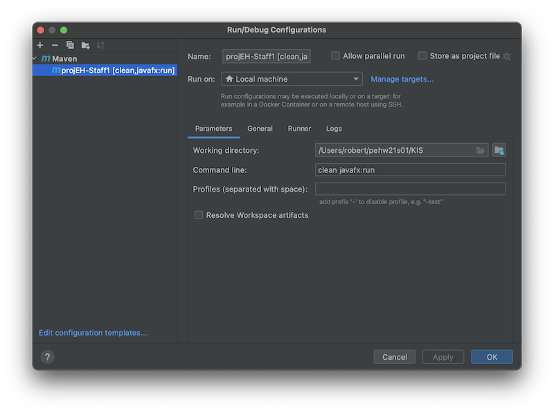
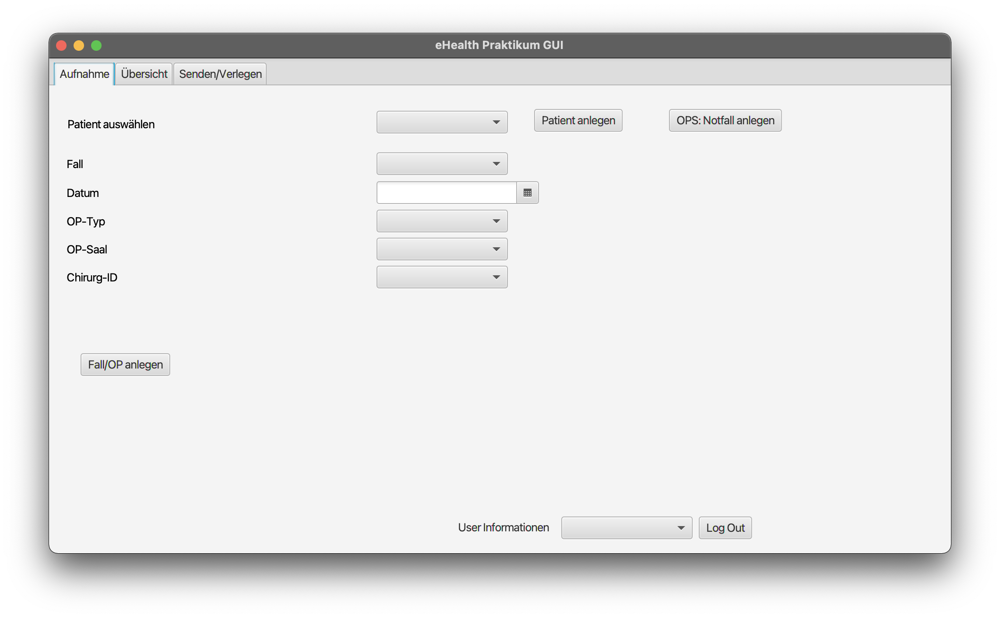

# Template für das eHealth-Projekt

## Wie greife ich auf die Controller-Klassen zu?

*Über die statische Methode `MainController.getInstance()`.* Alle weiteren Controller sind dann Attribute dieser Klasse und können von dieser aus erreicht werden. Dabei werden sie automatisch initialisiert, wenn sie im zugehörigen FXML als Controller eingetragen sind (beim vorgegebenen Template immer der Fall).

## Wie starte ich das Projekt?
Die folgenden goals (bekannt aus dem SE Praktikum) werden **nicht** benötigt: `compile site`, `test`, `javafx:jlink`

#### Über die Kommandozeile 
Im Root-Ordner (mit der pom.xml) `.../pehw21g0x/KIS/` bzw. `.../pehw21g0x/OPS/` folgenden Befehl ausführen: `mvn clean javafx:run` 

#### Über Eclipse

1. Das Projekt selektieren
2. Rechtsklick -> Run As -> Maven Build ... oder über Toolbar
  
  
3. Bei Goals `clean javafx:run` angeben:
  
  

Danach ist die Konfiguration über den Pfeil neben `Run` selektierbar

#### Über IntelliJ
Über `Edit configurations` (oben rechts) eine neue **Maven** configuration hinzufügen:
  

## Was sollte ich sehen wenn das Projekt erfolgreich gestartet wurde?

  

Bitte checkt auch den Output auf der Konsole auf Warnungen und Errors! Prüft zuerst, dass ihr die Vorlage ohne Fehler starten könnt bevor ihr das Projekt bearbeitet.
  
